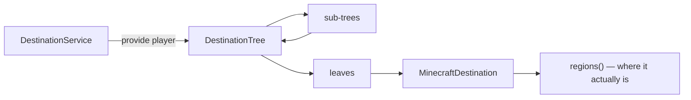

# Destinations

A **destination** is a named location that `/navigate` can route to. Destinations are supplied by a
`DestinationService`, which is queried per player, per search.

## Structure



## Minimal example

A single destination at a fixed location:

=== "Paper"

    ```java
    import org.cobblestonemc.paper.plugin.api.CobblestonePaperApi;
    import org.cobblestonemc.paper.plugin.api.Destination;
    import org.cobblestonemc.paper.plugin.api.DestinationService;
    import org.cobblestonemc.paper.plugin.api.DestinationTree;

    public final class ShopsPlugin extends JavaPlugin {
      @Override
      public void onEnable() {
        CobblestonePaperApi.registrar().registerDestinations(this, player ->
            DestinationTree.builder()
                .leaf("market", () -> Destination.at(marketLocation(), "Market"))
                .build());
      }
    }
    ```

=== "Sponge"

    ```java
    import net.kyori.adventure.text.Component;
    import org.cobblestonemc.sponge.plugin.api.CobblestoneSpongeApi;
    import org.cobblestonemc.sponge.plugin.api.Destination;
    import org.cobblestonemc.sponge.plugin.api.DestinationService;
    import org.cobblestonemc.sponge.plugin.api.DestinationTree;

    @Listener
    public void onStartedEngine(StartedEngineEvent<Server> event) {
      CobblestoneSpongeApi.registrar().registerDestinations(container, player ->
          DestinationTree.builder()
              .leaf("market", () -> Destination.at(marketLocation(), Component.text("Market")))
              .build());
    }
    ```

For a plugin named `Shops`, the address is `shops market`. Players may use `/nav market`, or
`/nav shops market` if the name is ambiguous.

!!! note

    The tree is already registered under the owner plugin's name. Do not add a top-level node for
    it.

## Trees

`DestinationTree.builder()` creates leaves and subtrees, each keyed by a string:

=== "Paper"

    ``` { .java .annotate }
    DestinationTree.builder()
        .subtree("warp", () -> warps(player))
        .subtree("dungeon", DestinationTree.builder()
            .strict()                                     // (1)!
            .leaf("crypt", () -> Destination.at(crypt, "The Crypt"))
            .leaf("mines", () -> Destination.at(mines, "Deep Mines"))
            .build())
        .build();
    ```

    1. A strict level cannot be omitted: `/nav dungeon crypt` is valid; `/nav crypt` is not.

=== "Sponge"

    ``` { .java .annotate }
    DestinationTree.builder()
        .subtree("warp", () -> warps(player))
        .subtree("dungeon", DestinationTree.builder()
            .strict()                                     // (1)!
            .leaf("crypt", () -> Destination.at(crypt, Component.text("The Crypt")))
            .leaf("mines", () -> Destination.at(mines, Component.text("Deep Mines")))
            .build())
        .build();
    ```

    1. A strict level cannot be omitted: `/nav dungeon crypt` is valid; `/nav crypt` is not.

Rules:

- **Keys** are single tokens. Upper case is permitted; special characters are not. Spaces are
  permitted but discouraged, since keys appear in commands and permission nodes.
- **Children are suppliers**, evaluated only when traversed.
- **Return `null`** from `provide` when there are no destinations for the player. Empty trees are
  omitted.
- **Mark large levels `strict()`.** Strict levels are skipped when computing suggestions.

### Lazy levels

=== "Paper"

    ```java
    private PlatformDestinationTree<World, Vector3i> warps(Player player) {
      DestinationTree tree = DestinationTree.builder().strict();
      for (Warp warp : store.visibleTo(player)) {
        // The lambda body runs only if this leaf is actually traversed.
        tree.leaf(warp.name(), () -> Destination.at(warp.location(), warp.name()));
      }
      return tree.build();
    }
    ```

=== "Sponge"

    ```java
    private PlatformDestinationTree<ServerWorld, Vector3i> warps(ServerPlayer player) {
      DestinationTree tree = DestinationTree.builder().strict();
      for (Warp warp : store.visibleTo(player)) {
        // The lambda body runs only if this leaf is actually traversed.
        tree.leaf(warp.name(), () -> Destination.at(warp.location(), Component.text(warp.name())));
      }
      return tree.build();
    }
    ```

## Destination types

`Destination` provides factories for common cases:

=== "Paper"

    ```java
    // A single block.
    Destination.at(location, "Market");

    // Anywhere in one region.
    Destination.region(BoxWorldRegion.of(corner1, corner2), "The Arena");
    Destination.region(BoxWorldRegion.around(center, 8), "Near the well");
    Destination.region(WholeWorldRegion.of(world), "The Nether");

    // Several regions — the search heads for whichever is cheapest to reach, and
    // the supplier is re-evaluated every search, so a moving target stays current.
    Destination.regions(() -> town.claims().stream().map(this::toRegion).toList(), "Riverwood");
    ```

=== "Sponge"

    ```java
    // A single block.
    Destination.at(location, Component.text("Market"));

    // Anywhere in one region.
    Destination.region(BoxWorldRegion.of(corner1, corner2), Component.text("The Arena"));
    Destination.region(BoxWorldRegion.around(center, 8), Component.text("Near the well"));
    Destination.region(WholeWorldRegion.of(world), Component.text("The Nether"));

    // Several regions — the search heads for whichever is cheapest to reach, and
    // the supplier is re-evaluated every search, so a moving target stays current.
    Destination.regions(
        () -> town.claims().stream().map(this::toRegion).toList(), Component.text("Riverwood"));
    ```

A destination with no regions is valid and unreachable. Use this when the target is temporarily
unavailable, such as when its world is unloaded.

### Moving targets

Implement `MinecraftDestination` directly to override `isMobile()`:

```java
public record NpcDestination(NPC npc) implements MinecraftDestination<World, Vector3i> {
  @Override
  public org.cobblestonemc.api.Destination<WorldRegion<World, Vector3i>> destination() {
    // Re-resolved on every query, so a live trip follows the NPC.
    return () -> npc.isSpawned()
        ? List.of(SingleCellWorldRegion.of(npc.getEntity().getLocation()))
        : List.of();
  }

  @Override
  public Component displayName() {
    return Component.text(npc.getName());
  }

  @Override
  public List<String> permissions() {
    return List.of();
  }

  @Override
  public boolean isMobile() {
    return true;  // trips to it default to -live
  }
}
```

`isMobile()` sets the default for live trips. Players may override it with `-live` or `-no-live`.

## Permissions

- **Destination node**: `cobblestone.navigate.<address>`. Generated automatically, default allow,
  and managed by server admins.
- **`permissions()`**: Additional required permissions, all of which the player must hold. Use for
  access control only. Cobblestone's own destinations declare none.

## Addressing

Players may omit leading words of an address if the remainder is unambiguous.

- The final key is always required.
- `strict()` levels are always required.
- Keys that collide across plugins are resolved by the player using the full address.
- Matching is case-insensitive; `quest` and `Quest` collide.
