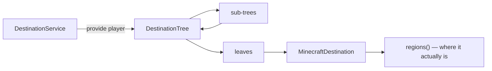

# Destinations

A **destination** is a named place `/navigate` can route to. You supply them with a
`DestinationService`, which Cobblestone calls **per player, per search** — so what you offer can
depend on who is asking and on the state of your plugin right now.

## The shape of it



## A minimal provider

Offer one place, a shop at a fixed location:

=== "Paper"

    ```java
    import org.cobblestonemc.paper.plugin.api.CobblestonePaperApi;
    import org.cobblestonemc.paper.plugin.api.Destination;
    import org.cobblestonemc.paper.plugin.api.DestinationService;
    import org.cobblestonemc.paper.plugin.api.DestinationTree;

    public final class ShopsPlugin extends JavaPlugin {
      @Override
      public void onEnable() {
        CobblestonePaperApi.registrar().registerDestinations(this, player ->
            DestinationTree.builder()
                .leaf("market", () -> Destination.at(marketLocation(), "Market"))
                .build());
      }
    }
    ```

=== "Sponge"

    ```java
    import net.kyori.adventure.text.Component;
    import org.cobblestonemc.sponge12.plugin.api.CobblestonePluginApi;
    import org.cobblestonemc.sponge12.plugin.api.Destination;
    import org.cobblestonemc.sponge12.plugin.api.DestinationService;
    import org.cobblestonemc.sponge12.plugin.api.DestinationTree;

    @Listener
    public void onStartedEngine(StartedEngineEvent<Server> event) {
      CobblestonePluginApi.registrar().registerDestinations(container, player ->
          DestinationTree.builder()
              .leaf("market", () -> Destination.at(marketLocation(), Component.text("Market")))
              .build());
    }
    ```

If your plugin is called `Shops`, that destination's address is `shops market` and players reach it
with `/nav market` (or `/nav shops market` when something else also offers a `market`).

!!! note "Don't name a level after yourself"

    Cobblestone already files your tree under your plugin's name. Build the levels *below* that —
    a `warp` sub-tree, not a `myplugin` sub-tree.

## Building a tree

`DestinationTree.builder()` gives you leaves and sub-trees, both keyed by string:

=== "Paper"

    ``` { .java .annotate }
    DestinationTree.builder()
        .subtree("warp", () -> warps(player))
        .subtree("dungeon", DestinationTree.builder()
            .strict()                                     // (1)!
            .leaf("crypt", () -> Destination.at(crypt, "The Crypt"))
            .leaf("mines", () -> Destination.at(mines, "Deep Mines"))
            .build())
        .build();
    ```

    1. A strict level can never be omitted by the player: they must type
       `/nav dungeon crypt`, not `/nav crypt`.

=== "Sponge"

    ``` { .java .annotate }
    DestinationTree.builder()
        .subtree("warp", () -> warps(player))
        .subtree("dungeon", DestinationTree.builder()
            .strict()                                     // (1)!
            .leaf("crypt", () -> Destination.at(crypt, Component.text("The Crypt")))
            .leaf("mines", () -> Destination.at(mines, Component.text("Deep Mines")))
            .build())
        .build();
    ```

    1. A strict level can never be omitted by the player: they must type
       `/nav dungeon crypt`, not `/nav crypt`.

Rules worth knowing:

- **Keys** are single tokens. Upper case is allowed, special characters aren't, spaces are allowed
  but strongly discouraged — the key ends up in a command and in a permission node.
- **Children are suppliers.** Nothing below a level is evaluated until a player actually walks into
  it, so a tree with ten thousand towns costs nothing until someone types `town `.
- **Return `null`** from `provide` when you have nothing for this player. An empty tree is dropped
  too, rather than being offered as a dead end.
- **Mark big levels `strict()`.** Besides forcing the player to be explicit, it stops Cobblestone
  from even visiting the level while computing suggestions.

### Lazy levels

The supplier form is the point. Only materialize when asked:

=== "Paper"

    ```java
    private PlatformDestinationTree<World, Vector3i> warps(Player player) {
      DestinationTree tree = DestinationTree.builder().strict();
      for (Warp warp : store.visibleTo(player)) {
        // The lambda body runs only if this leaf is actually traversed.
        tree.leaf(warp.name(), () -> Destination.at(warp.location(), warp.name()));
      }
      return tree.build();
    }
    ```

=== "Sponge"

    ```java
    private PlatformDestinationTree<ServerWorld, Vector3i> warps(ServerPlayer player) {
      DestinationTree tree = DestinationTree.builder().strict();
      for (Warp warp : store.visibleTo(player)) {
        // The lambda body runs only if this leaf is actually traversed.
        tree.leaf(warp.name(), () -> Destination.at(warp.location(), Component.text(warp.name())));
      }
      return tree.build();
    }
    ```

## What a destination is

`Destination` builds the common shapes for you:

=== "Paper"

    ```java
    // A single block.
    Destination.at(location, "Market");

    // Anywhere in one region.
    Destination.region(BoxWorldRegion.of(corner1, corner2), "The Arena");
    Destination.region(BoxWorldRegion.around(center, 8), "Near the well");
    Destination.region(WholeWorldRegion.of(world), "The Nether");

    // Several regions — the search heads for whichever is cheapest to reach, and
    // the supplier is re-evaluated every search, so a moving target stays current.
    Destination.regions(() -> town.claims().stream().map(this::toRegion).toList(), "Riverwood");
    ```

=== "Sponge"

    ```java
    // A single block.
    Destination.at(location, Component.text("Market"));

    // Anywhere in one region.
    Destination.region(BoxWorldRegion.of(corner1, corner2), Component.text("The Arena"));
    Destination.region(BoxWorldRegion.around(center, 8), Component.text("Near the well"));
    Destination.region(WholeWorldRegion.of(world), Component.text("The Nether"));

    // Several regions — the search heads for whichever is cheapest to reach, and
    // the supplier is re-evaluated every search, so a moving target stays current.
    Destination.regions(
        () -> town.claims().stream().map(this::toRegion).toList(), Component.text("Riverwood"));
    ```

A destination with **no** regions is legal and simply has nowhere to go — that's how an integration
handles "the world this home is in isn't loaded" without breaking the tree.

### Moving targets

Implement `MinecraftDestination` yourself when you need `isMobile()`:

```java
public record NpcDestination(NPC npc) implements MinecraftDestination<World, Vector3i> {
  @Override
  public org.cobblestonemc.api.Destination<WorldRegion<World, Vector3i>> destination() {
    // Re-resolved on every query, so a live trip follows the NPC.
    return () -> npc.isSpawned()
        ? List.of(SingleCellWorldRegion.of(npc.getEntity().getLocation()))
        : List.of();
  }

  @Override
  public Component displayName() {
    return Component.text(npc.getName());
  }

  @Override
  public List<String> permissions() {
    return List.of();
  }

  @Override
  public boolean isMobile() {
    return true;  // trips to it default to -live
  }
}
```

`isMobile()` only sets the **default** for liveness; the player can still override it with `-live`
or `-no-live`.

## Permissions

Two separate things:

- **Cobblestone's gate** — `cobblestone.navigate.<your address>`, generated automatically,
  default-allow, and entirely the admin's business. You don't have to do anything for this.
- **`permissions()` on your destination** — hard requirements, *all* of which the player must hold.
  Reserve it for genuine access control ("this dungeon is unlocked at rank 3"), not for
  "admins might want to hide this". Cobblestone's own destinations declare none.

## Addressing, from your side

Players may omit leading words of an address as long as the result is unambiguous, so your key
choices are part of the user interface:

- The **last** key is always required.
- A `strict()` level is always required.
- Keys that collide across plugins (two `home`s) still work — Cobblestone reports the ambiguity and
  lists the full addresses, and the player picks.

Case is folded when matching, so registering both `quest` and `Quest` is a collision, not two
branches.
