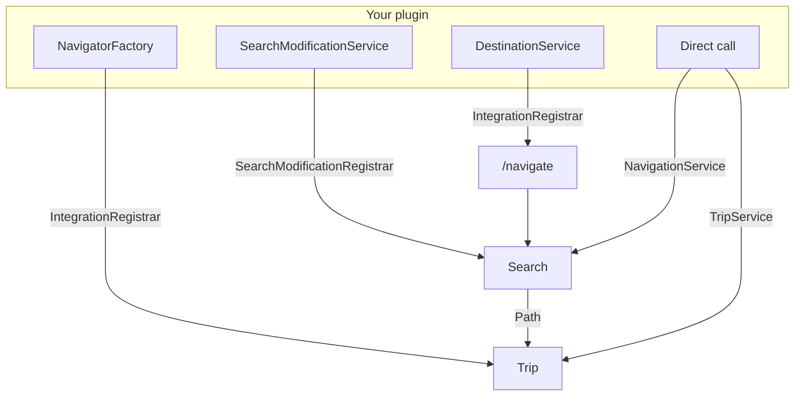

<div class="cs-illustration">

</div>

# Developers

| Task | Page |
| --- | --- |
| Register destinations | [Destinations](destinations.md) |
| Start a trip for a player | [Trips](trips.md) |
| Add teleports and other transitions to searches | [Search modification](search-modification.md) |
| Restrict where searches may break or pass | [Search modification](search-modification.md) |
| Render routes with a custom navigator | [Navigators](navigators.md) |
| Run a search and read the path | [Searching](searching.md) |

Platform-specific code blocks are tabbed. Selecting **Paper** or **Sponge** applies site-wide.

## Dependency

Two artifacts are published per platform:

- **`…-api`**: The navigation library: searches and search modifications.
- **`…-plugin-api`**: Plugin features: destinations, navigators, and trips. Includes `…-api`
  transitively.

Most integrations should depend on `…-plugin-api`.

=== "Paper"

    ```kotlin title="build.gradle.kts"
    repositories {
        mavenCentral()
    }

    dependencies {
        // Provided at runtime by the Cobblestone plugin — never shade it.
        compileOnly("org.cobblestonemc:paper-plugin-api:0.1.0")
    }
    ```

    ```xml title="pom.xml"
    <dependency>
      <groupId>org.cobblestonemc</groupId>
      <artifactId>paper-plugin-api</artifactId>
      <version>0.1.0</version>
      <scope>provided</scope>
    </dependency>
    ```

    Declare the dependency so that Cobblestone loads first:

    ```yaml title="paper-plugin.yml"
    dependencies:
      server:
        cobblestone:
          load: BEFORE
    ```

=== "Sponge"

    ```kotlin title="build.gradle.kts"
    repositories {
        mavenCentral()
    }

    dependencies {
        // Provided at runtime by the Cobblestone plugin — never shade it.
        compileOnly("org.cobblestonemc:sponge-12-plugin-api:0.1.0")
    }
    ```

    ```xml title="pom.xml"
    <dependency>
      <groupId>org.cobblestonemc</groupId>
      <artifactId>sponge-12-plugin-api</artifactId>
      <version>0.1.0</version>
      <scope>provided</scope>
    </dependency>
    ```

    Declare the dependency so that Cobblestone loads first:

    ```json title="META-INF/sponge_plugins.json"
    "dependencies": [
      { "id": "cobblestone", "load-order": "after", "optional": false }
    ]
    ```

!!! warning "Do not shade the API"

    The API is provided at runtime by the Cobblestone plugin. A shaded copy causes
    `ClassCastException`s across class loaders.

Latest version:
[](https://central.sonatype.com/namespace/org.cobblestonemc).
The API is pre-1.0 and may change between minor versions.

## Services

Services are accessed through two static entry points:

=== "Paper"

    ```java
    import org.cobblestonemc.paper.api.CobblestoneCoreApi;
    import org.cobblestonemc.paper.plugin.api.CobblestonePaperApi;

    // …-api: the navigation library
    NavigationService navigation = CobblestoneCoreApi.navigationService();
    SearchModificationRegistrar searches = CobblestoneCoreApi.registrar();

    // …-plugin-api: destinations, navigators, trips
    IntegrationRegistrar integrations = CobblestonePaperApi.registrar();
    TripService trips = CobblestonePaperApi.tripService();
    ```

    Both query Bukkit's `ServicesManager`. Call them from `onEnable()` or later, not from a
    constructor.

=== "Sponge"

    ```java
    import org.cobblestonemc.sponge12.api.CobblestoneCoreApi;
    import org.cobblestonemc.sponge12.plugin.api.CobblestonePluginApi;

    // …-api: the navigation library
    NavigationService navigation = CobblestoneCoreApi.navigationService();
    SearchModificationRegistrar searches = CobblestoneCoreApi.registrar();

    // …-plugin-api: destinations, navigators, trips
    IntegrationRegistrar integrations = CobblestonePluginApi.registrar();
    TripService trips = CobblestonePluginApi.tripService();
    ```

    Cobblestone populates these holders during its `ConstructPluginEvent`. Access them from
    `StartingEngineEvent` or later.

!!! note "Naming"

    The Paper accessor is `CobblestonePaperApi`; the Sponge accessor is `CobblestonePluginApi`.
    The names will be aligned in a future major version.

## Ownership

Every registration has an **owner plugin**. Registrations are removed when the owner disables. The
owner's name also determines the destination branch and its permission nodes.

=== "Paper"

    ```java
    CobblestonePaperApi.registrar().registerDestinations(this, new MyDestinations());
    ```

    Passing `this` registers destinations under your plugin's lower-cased name.

    An integration for another plugin should pass that plugin, so that the address is
    `town riverwood home` rather than `cobblestonetowny town riverwood home`:

    ```java
    Plugin towny = getServer().getPluginManager().getPlugin("Towny");
    CobblestonePaperApi.registrar().registerDestinations(towny, new TownyDestinations());
    ```

=== "Sponge"

    ```java
    CobblestonePluginApi.registrar().registerDestinations(container, new MyDestinations());
    ```

    Passing your `PluginContainer` registers destinations under your plugin's lower-cased id.

    An integration for another plugin should pass that plugin's container, so that the address is
    `town riverwood home` rather than `cobblestonetowny town riverwood home`:

    ```java
    PluginContainer towny = Sponge.pluginManager().plugin("towny").orElseThrow();
    CobblestonePluginApi.registrar().registerDestinations(towny, new TownyDestinations());
    ```

## Architecture



- **Destination**: A named location that players can navigate to.
- **Search**: Computes a `Path` from a player to a destination.
- **Search modification**: Adds transitions and restricts which blocks may be broken or entered.
- **Trip**: A path being followed by a player, ticked by Cobblestone.
- **Navigator**: Renders a trip.

## Threading

- `SearchHandle.future()` completes on a Cobblestone thread. Return to the main thread (or region
  thread on Folia) before accessing server state.
- `computeTransitions`, `computeBreakChecker`, and `computePassChecker` run once per search on the
  calling thread, normally the main thread.
- The returned checkers run during the search, possibly off the main thread, and return a
  `CompletableFuture`. Checks that require the main thread must schedule work there and complete
  the future.
- Checkers are invoked thousands of times per search. Return completed futures where possible and
  cache results per search.
