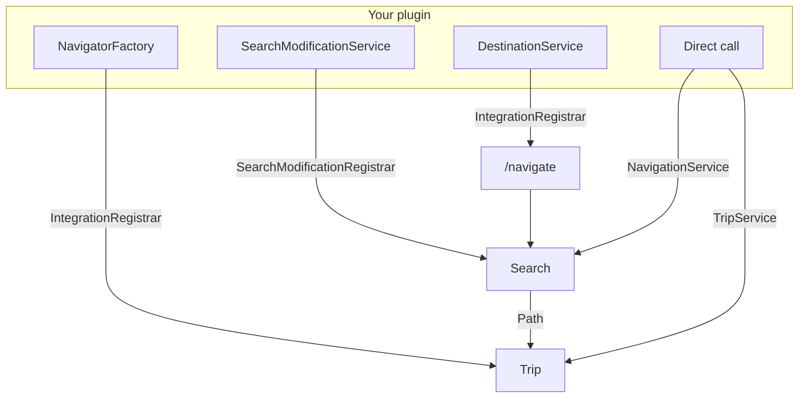

<div class="cs-illustration">

</div>

# For developers

Cobblestone is extensible in four places. Pick the one that matches what you want:

| I want to… | Use |
| --- | --- |
| Offer places players can navigate to | [Destinations](destinations.md) |
| Send a player somewhere right now, from my own code | [Trips](trips.md) |
| Teach the search about a warp, a pad, a `/home` | [Search modification](search-modification.md) |
| Stop routes digging or walking where they shouldn't | [Search modification](search-modification.md) |
| Draw a route my own way | [Navigators](navigators.md) |
| Run a search and read the path myself | [Searching](searching.md) |

!!! tip "Every code block on this site is tabbed"

    Pick **Paper** or **Sponge** once and the whole site follows.

## Depend on Cobblestone

There are two published artifacts per platform:

- **`…-api`** — the navigation library: run a search, modify a search. No plugin opinions.
- **`…-plugin-api`** — what the Cobblestone *plugin* adds: destinations, navigators, trips. It
  depends on `…-api`, so depending on this one gives you both.

Most integrations want `…-plugin-api`.

=== "Paper"

    ```kotlin title="build.gradle.kts"
    repositories {
        mavenCentral()
    }

    dependencies {
        // Provided at runtime by the Cobblestone plugin — never shade it.
        compileOnly("org.cobblestonemc:paper-plugin-api:0.1.0")
    }
    ```

    ```xml title="pom.xml"
    <dependency>
      <groupId>org.cobblestonemc</groupId>
      <artifactId>paper-plugin-api</artifactId>
      <version>0.1.0</version>
      <scope>provided</scope>
    </dependency>
    ```

    Then declare the dependency so Cobblestone loads first:

    ```yaml title="paper-plugin.yml"
    dependencies:
      server:
        cobblestone:
          load: BEFORE
    ```

=== "Sponge"

    ```kotlin title="build.gradle.kts"
    repositories {
        mavenCentral()
    }

    dependencies {
        // Provided at runtime by the Cobblestone plugin — never shade it.
        compileOnly("org.cobblestonemc:sponge-12-plugin-api:0.1.0")
    }
    ```

    ```xml title="pom.xml"
    <dependency>
      <groupId>org.cobblestonemc</groupId>
      <artifactId>sponge-12-plugin-api</artifactId>
      <version>0.1.0</version>
      <scope>provided</scope>
    </dependency>
    ```

    Then declare the dependency so Cobblestone loads first:

    ```json title="META-INF/sponge_plugins.json"
    "dependencies": [
      { "id": "cobblestone", "load-order": "after", "optional": false }
    ]
    ```

!!! warning "compileOnly / provided, always"

    The API classes live inside the Cobblestone plugin jar at runtime. Bundling your own copy
    splits the type identity across class loaders and everything fails with confusing
    `ClassCastException`s.

The latest published version is on the badge:
[](https://central.sonatype.com/namespace/org.cobblestonemc).
Cobblestone is 0.x — the API may change between minor versions.

## Find the services

Two entry points, each a static accessor:

=== "Paper"

    ```java
    import org.cobblestonemc.paper.api.CobblestoneCoreApi;
    import org.cobblestonemc.paper.plugin.api.CobblestonePaperApi;

    // …-api: the navigation library
    NavigationService navigation = CobblestoneCoreApi.navigationService();
    SearchModificationRegistrar searches = CobblestoneCoreApi.registrar();

    // …-plugin-api: destinations, navigators, trips
    IntegrationRegistrar integrations = CobblestonePaperApi.registrar();
    TripService trips = CobblestonePaperApi.tripService();
    ```

    Both look up Bukkit's `ServicesManager`, so call them from `onEnable()` (with the
    `load: BEFORE` dependency declared) or later — never from your constructor.

=== "Sponge"

    ```java
    import org.cobblestonemc.sponge12.api.CobblestoneCoreApi;
    import org.cobblestonemc.sponge12.plugin.api.CobblestonePluginApi;

    // …-api: the navigation library
    NavigationService navigation = CobblestoneCoreApi.navigationService();
    SearchModificationRegistrar searches = CobblestoneCoreApi.registrar();

    // …-plugin-api: destinations, navigators, trips
    IntegrationRegistrar integrations = CobblestonePluginApi.registrar();
    TripService trips = CobblestonePluginApi.tripService();
    ```

    Sponge has no service manager, so Cobblestone installs itself into these holders during its own
    `ConstructPluginEvent`. Fetch them from `StartingEngineEvent` or later, with the dependency
    declared — not during construction.

!!! note "Naming"

    The Paper accessor is `CobblestonePaperApi` and the Sponge one is `CobblestonePluginApi`. The
    inconsistency is unfortunate and is kept because the artifacts are already published; it is
    slated to change in a future major version.

## Register with an owner

Everything is registered on behalf of an **owner plugin**, and everything an owner registered is
dropped automatically when that plugin disables. This is also what names your branch of the
destination tree, and therefore the permission nodes under it.

=== "Paper"

    ```java
    CobblestonePaperApi.registrar().registerDestinations(this, new MyDestinations());
    ```

    Passing `this` files your destinations under your own plugin's name, lower-cased.

    An integration for *another* plugin usually passes **that** plugin instead, so the tree reads
    `/nav town riverwood home` rather than `/nav cobblestonetowny town riverwood home`:

    ```java
    Plugin towny = getServer().getPluginManager().getPlugin("Towny");
    CobblestonePaperApi.registrar().registerDestinations(towny, new TownyDestinations());
    ```

=== "Sponge"

    ```java
    CobblestonePluginApi.registrar().registerDestinations(container, new MyDestinations());
    ```

    Passing your own `PluginContainer` files your destinations under your plugin's id, lower-cased.

    An integration for *another* plugin usually passes **that** plugin's container instead, so the
    tree reads `/nav town riverwood home` rather than `/nav cobblestonetowny town riverwood home`:

    ```java
    PluginContainer towny = Sponge.pluginManager().plugin("towny").orElseThrow();
    CobblestonePluginApi.registrar().registerDestinations(towny, new TownyDestinations());
    ```

## How the pieces fit



- A **destination** is a place a player can ask for by name.
- A **search** turns "this player, that destination" into a `Path`.
- **Search modifications** change what the search may do: extra edges, and what may be broken or
  walked through.
- A **trip** is a path being followed, ticked by Cobblestone.
- A **navigator** is how a trip is drawn.

## Threading

- **Searches are asynchronous.** `SearchHandle.future()` completes on a Cobblestone thread. Hop
  back to the main thread (or a region thread on Folia) before touching most server state.
- **`computeTransitions`, `computeBreakChecker` and `computePassChecker` run once per search**, on
  the thread that started it — normally the main thread — so reading server state there is safe.
- **The checkers they return run during the search**, possibly off the main thread. They answer
  with a `CompletableFuture`, so a check that needs the main thread (as Towny's build check does)
  schedules the work and completes the future from there.
- **Keep the checkers cheap.** They run inside the search's hot loop, thousands of times per solve.
  An already-completed future keeps the search on its fast path; cache per search where you can.
