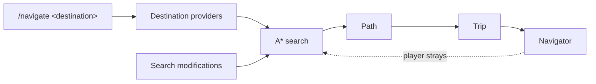

<!-- Google tag (gtag.js) -->
<script async src="https://www.googletagmanager.com/gtag/js?id=G-Q76LDBF416"></script>
<script>
  window.dataLayer = window.dataLayer || [];
  function gtag(){dataLayer.push(arguments);}
  gtag('js', new Date());

  gtag('config', 'G-Q76LDBF416');
</script>

<div class="cs-hero" markdown>
<div class="cs-hero__text" markdown>

# Cobblestone

<p class="cs-hero__tagline">Server-side navigation for Minecraft.</p>

<div class="cs-badges">
<a href="https://modrinth.com/plugin/cobblestoneplugin"></a>
<a href="https://modrinth.com/plugin/cobblestoneplugin"></a>
<a href="https://bstats.org/plugin/bukkit/Cobblestone/33624"></a>
<a href="https://bstats.org/plugin/sponge/Cobblestone/33625"></a>
<a href="https://central.sonatype.com/artifact/org.cobblestonemc/paper-plugin-api"></a>

</div>

</div>
<div class="cs-hero__art">

</div>
</div>

<div class="grid cards" markdown>

-   **[Players](players.md)**

    Save locations and navigate to them.

-   **[Server admins](admins/index.md)**

    Installation, commands, permissions, and configuration.

-   **[Developers](developers/index.md)**

    Register destinations, modify searches, and start trips.

</div>

## Overview

Cobblestone runs an A* search over the live world and renders the resulting route as a particle
trail. Routes account for walking, swimming, climbing, falling, boats, horses, doors, and portals.
If the player leaves the route, it is recomputed.

Cobblestone does not teleport players itself. Integrations can register teleport commands, such as
EssentialsX `/home` or Towny `/town spawn`, as route steps that the player is prompted to run.

```
/stone location set home        # save the current position
/nav home                       # navigate back to it
```

## Architecture



Destination providers, search modifications, and navigators are all extensible. See the
[developer documentation](developers/index.md).

## Supported versions

| Platform | Minecraft | Java |
| --- | --- | --- |
| Paper | 26.1+ | 25+ |
| Sponge | 1.21.1 | 21+ |
| Sponge | 26.1+ | 25+ |

## Performance

Searches run asynchronously and are bounded per player. The [configuration](admins/config.md#search)
file exposes options to increase or reduce the resources each search may use.

## Metrics

Cobblestone reports anonymous, aggregate usage data to [bStats](https://bstats.org). Disable it
with `metrics.enabled: false`.

## Support

- [Issue tracker](https://github.com/CobblestoneMC/cobblestone/issues)
- [Releases and changelogs](https://modrinth.com/plugin/cobblestoneplugin)
- [Source code](https://github.com/CobblestoneMC/cobblestone)
