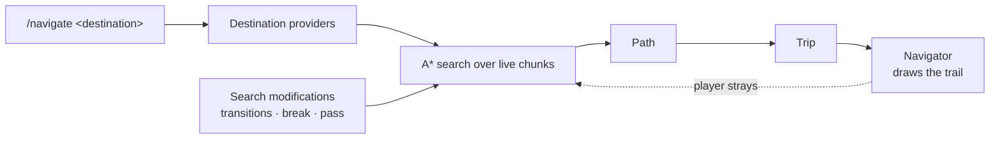

<div class="cs-hero" markdown>
<div class="cs-hero__text" markdown>

# Cobblestone

<p class="cs-hero__tagline">Turn-by-turn navigation for Minecraft servers. Ask for a place,
follow the trail, get there — no map mod, no client install, no teleporting.</p>

<div class="cs-badges">
<a href="https://github.com/CobblestoneMC/cobblestone/actions/workflows/build.yml"></a>
<a href="https://modrinth.com/plugin/cobblestoneplugin"></a>
<a href="https://modrinth.com/plugin/cobblestoneplugin"></a>
<a href="https://bstats.org/plugin/bukkit/Cobblestone/33624"></a>
<!-- Sponge bStats badge — fill in the Sponge plugin id once it is registered:
<a href="https://bstats.org/plugin/sponge/Cobblestone/SPONGE_ID"></a> -->
<a href="https://central.sonatype.com/artifact/org.cobblestonemc/paper-plugin-api"></a>

</div>

</div>
<div class="cs-hero__art">

</div>
</div>

<div class="cs-cards" markdown>

<a class="cs-card" href="players/" markdown>
### I'm a player
Save places, find your way back to your stuff, and follow a trail to a town, an NPC, or a friend.
</a>

<a class="cs-card" href="admins/" markdown>
### I run a server
Install it, tune what searches may cost, and decide who can navigate where.
</a>

<a class="cs-card" href="developers/" markdown>
### I build plugins
Register your own destinations, add travel routes, or send a player on a guided trip.
</a>

</div>

## What Cobblestone does

A player types `/nav home` and Cobblestone runs a real pathfinding search over your live world —
the same blocks the player would walk through. It accounts for walking, swimming, climbing,
falling, boats, horses, doors, and the nether and end portals it has watched players use. What
comes back is a route the player can actually walk, drawn as a particle trail that flows ahead of
them and recalculates when they wander off it.

Nothing is teleported and nothing is revealed: a player can only navigate to places they already
know about, and the trail shows the way rather than skipping it.

```
/stone location set home        # remember where you are
/nav home                       # …then walk back to it from anywhere
```

## How it works



Everything in that diagram except the search itself is extensible: other plugins add destinations,
add travel routes (a warp, a `/home` command, a portal pad), constrain where a player may dig or
walk, and supply their own way of displaying a route. See the [developer
documentation](developers/index.md).

## Good to know

!!! info "Supported platforms"

    Cobblestone runs on **Paper 1.21+** on Java 25+ (Folia included) and **Sponge API 12** on
    Java 21+. There is no
    Spigot, Fabric, NeoForge, or Velocity build — the plugin needs a modern server API for
    asynchronous chunk access, and each platform is a separate port rather than a recompile. If you
    want another platform, say so in an
    [issue](https://github.com/CobblestoneMC/cobblestone/issues).

!!! info "Server-side only"

    Players do not install anything. The trail is drawn with ordinary particles, so it works on a
    vanilla client.

!!! info "Integrations are separate downloads"

    Towny, EssentialsX, Citizens, BetonQuest, BeautyQuests, Quests, and Typewriter each have their
    own small companion plugin. Install only the ones you use — see
    [Integrations](admins/integrations.md). The integrations published from this repository are
    Paper builds today.

!!! info "Searches cost CPU, and you set the budget"

    A search is bounded by a cell limit and a wall-clock budget, runs off the main thread, and is
    limited per player. On a small server the defaults are fine; on a big one, read
    [Configuration](admins/config.md#search).

!!! info "Anonymous metrics"

    Cobblestone reports aggregate, non-identifying counts to [bStats](https://bstats.org). Turn it
    off with `metrics.enabled: false`, or globally in `plugins/bStats/config.yml`.

!!! warning "0.x"

    Cobblestone is young. Commands and config keys are stable enough to build a server on, but the
    developer API may still change between minor versions; breaking changes are called out in the
    release notes.

## Getting help

- **Bugs and feature requests:** [GitHub issues](https://github.com/CobblestoneMC/cobblestone/issues)
- **Downloads and changelogs:** [Modrinth](https://modrinth.com/plugin/cobblestoneplugin)
- **Source:** [github.com/CobblestoneMC/cobblestone](https://github.com/CobblestoneMC/cobblestone)
